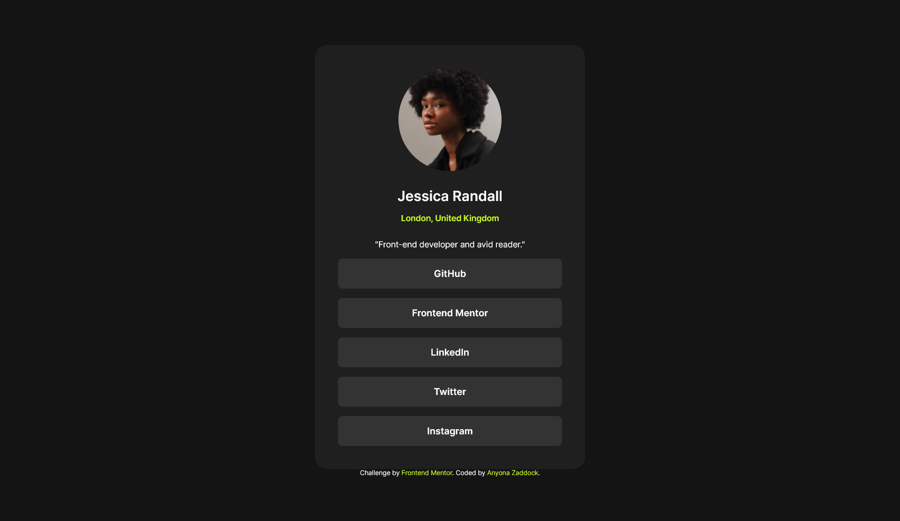
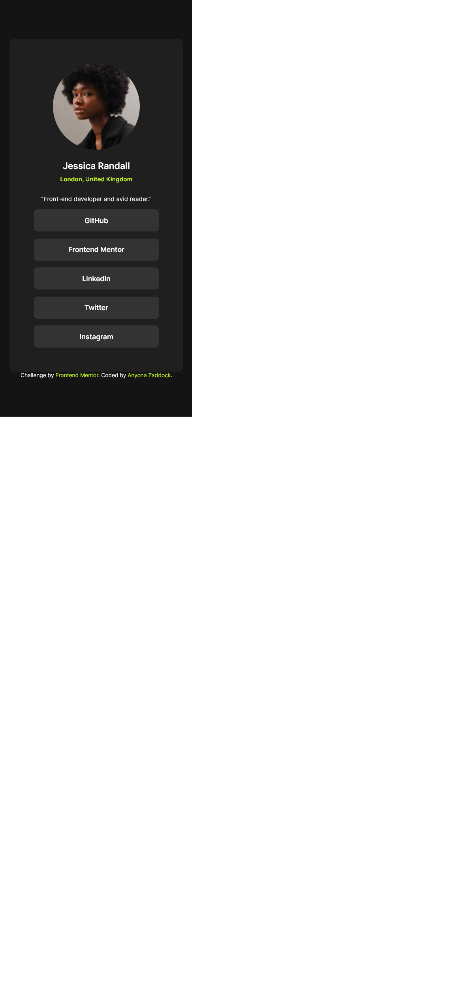
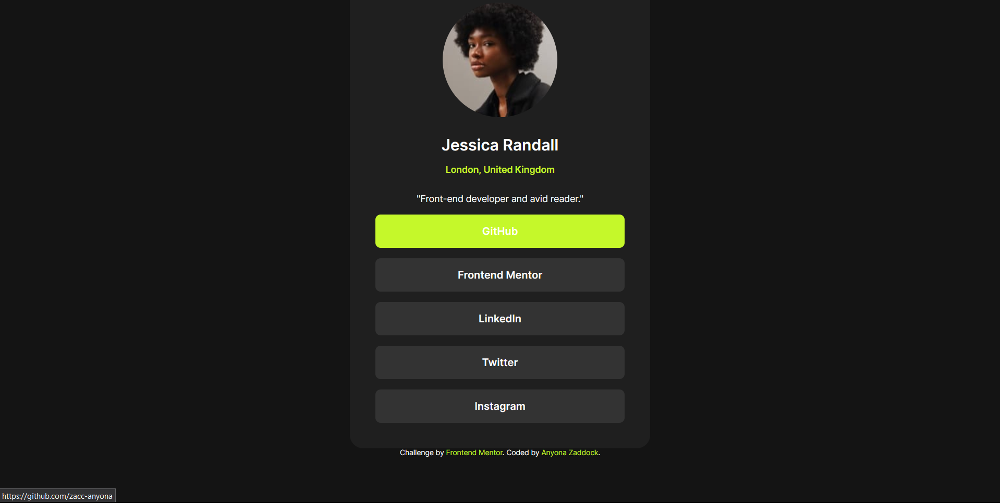

# Frontend Mentor - Social links profile solution

This is a solution to the [Social links profile challenge on Frontend Mentor](https://www.frontendmentor.io/challenges/social-links-profile-UG32l9m6dQ). Frontend Mentor challenges help you improve your coding skills by building realistic projects. 

## Table of contents

- [Overview](#overview)
  - [The challenge](#the-challenge)
  - [Screenshot](#screenshot)
  - [Links](#links)
- [My process](#my-process)
  - [Built with](#built-with)
  - [What I learned](#what-i-learned)
  - [Continued development](#continued-development)
  - [Useful resources](#useful-resources)
- [Author](#author)
- [Acknowledgments](#acknowledgments)


## Overview
  This project is a challenge from Frontend Mentor that involves me creating a similar page (social links profile page) to the designs  I was provided for as jpg photos. Below are the design photos I was to emulate.
  
  
  
### The challenge

Users should be able to:

-Design solutions should match the designs provided by Frontend Mentor.
- See hover and focus states for all interactive elements on the page.

### Screenshots To My Solutions

  
  
  


### Links

- Solution URL: [GitHub Repository](https://github.com/zacc-anyona/Social-Links-Profile-Challenge-by-Frontend-Mentor-)
- Live Site URL: [View my solution live using Netlify](https://anyona-social-link-profile.netlify.app/)
- Alternate Site URL: [View my solution live using Vercel](https://social-links-profile-challenge-by-frontend-mentor.vercel.app/)

## My process
  My plan to execute the challenge to completion is simple. These are the steps I followed to complete the challenge.
    
    1. Undersatanding and familiarising myself with challenge requirements.
    2. Come up with a plan for executing the challenge
    3. Semantically markup the the page's content using HTML.
    4. Use CSS style up the body and add the necessary fonts to my page.
      Created CSS variables for the colors I would be using.
    5. **Responsiveness** is always crucial when building a web page. I started out with the mobile dsesign and finished with the desktop design.
    6. I had to make page accessible. Made sure for the images they had an alt text. Did my best to landmark the page by use of footer, header and main tags.
    7. The last step was to test my page on variety of browsers such as Chrome, Brave, Microsoft Edge, Firefox and Opera.


### Built with

- Semantic HTML5 markup
- CSS custom properties


### What I learned

  As I built the page code by codE, I learnt some few things.
   -Centering the list items was bit of a challenge. It took me a while to realise list items had default indentation, so I had to remove the indentation in order to center them
   ```css
    ul {
      padding: 0;
    }
   ```


### Continued development

  Box-sizing especially space taken by inline and block elements was crucial in this challenge. 
  Sounds simple, I prefer to work on it so that in future projects I don't get to undermine it.

### Useful resources

-[Amerix HTML Course](https://www.amerix.co.ke/challenge-page/HTML-for-Beginners) Specifically the use of `<figure></figure>` from the Amerix's course helped me in solving the challenge.
Amerix is a good teacher. His course will get you started in HTML in no time.
I dare say problem solving skills was a useful resource personally. 

## Author

- Frontend Mentor - [@zacc-anyona](https://www.frontendmentor.io/profile/zacc-anyona)
- Twitter - [@anyona_zadocc](https://twitter.com/anyona_zadocc)


## Reviews
 I invite all kind of reviews and criticisms if any to this project.
 I believe it will aid in my development process in becoming a **Legendary** web developer.
 Feel free to reach out mate.

## Acknowledgments

- I want to thank **Me** for taking my time to complete this challenge.
- I want to thank **Frontend Mentor** for making this challenge available to everyone.